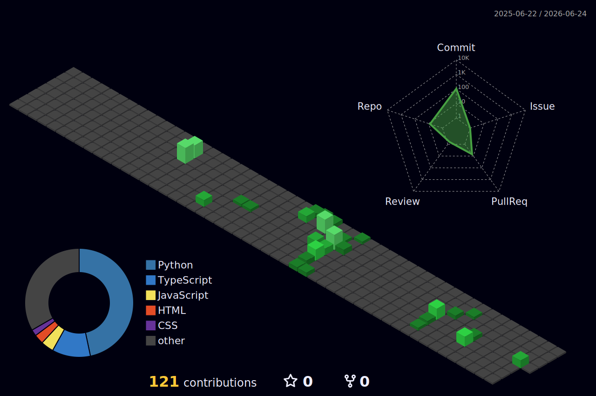

<div align="center">
  
</div>

<div align="center">

  **반갑습니다!** 데이터와 AI에 진심인 신주용입니다 🚀

</div>

<br/>

---

## About Me

```yaml
Name: 신주용 (Shin Juyong)
Role: AI Engineer
Education: 경상국립대학교 제어계측공학
Location: South Korea 🇰🇷
Interests: LLM & Generative AI, RAG Systems, AI Agent Development, Prompt Engineering
Email: robotshin96@gmail.com
```

<br/>

---

## Experience

<div align="center">

| 기간 | 회사 | 부서 | 직무 |
|:----:|:----:|:----:|:----:|
| 2026.03 ~ 재직 중 | **주식회사 인프라엑스** | 개발팀 | AI 연구원 |

</div>

<br/>

---

## Awards & Competitions

<div align="center">

| 대회명 | 수상/성적 | 주최 | 날짜 |
|:------|:--------:|:----:|:----:|
| [**KSPO 공공데이터 경진대회**](https://m.sports.naver.com/general/article/311/0001955961) | 🥇 **대상** | 국민체육진흥공단 | 2025.12 |
| [**AI NoCode·MCP Hackathon**](https://www.youtube.com/shorts/R958NZzaz28) | 🥈 우수상 | 과학기술정보통신부 | 2025.11 |
| [**Kaggle: MABe Challenge**](https://www.kaggle.com/competitions/MABe-mouse-behavior-detection) | **Top 14%** (200/1412) | Kaggle | 2025.12 |
| [**Kaggle: CAFA 6 Protein Function Prediction**](./assets/cafa6-silver-medal.png) | 🥈 **Silver Medal** (112/2259) | Kaggle | 2026.06 |
| [**2026 Fast Builderthon**](https://fastcampus.co.kr/builderthon2026) | 본선 진출 | 패스트캠퍼스 | 2026.01 |

</div>

> 📈 **Kaggle MABe**: Public 620등 → Private **200등** (+420↑)
>
> 🥈 **Kaggle CAFA 6**: 2,259팀 중 **112위** — Competition Silver Medalist (클릭 시 인증서)

<br/>

---

## Certifications

<div align="center">

| 자격증 | 등급 | 발행처 |
|:------|:----:|:------:|
| 데이터 분석 준전문가 (ADsP) | 준전문가 | 한국데이터산업진흥원 |
| KT AICE | Basic | KT |
| 네이버 클라우드 플랫폼 (NCP) | Associate | 네이버 클라우드 |
| 인공지능활용능력 | - | 한국인공지능자격센터 |
| 정보처리산업기사 | 필기 | 한국산업인력공단 |
| 정보처리기사 | 필기 | 한국산업인력공단 |

</div>

<br/>

---

## Education & Training

<div align="center">

| 기간 | 교육명 | 기관 |
|:----:|:------|:----:|
| 2023.07 ~ 2023.08 | LG Aimers 3기 | LG AI Research |
| 2023.10 ~ 2024.05 | **Upstage AI Lab 1기** | 패스트캠퍼스 |
| 2024.07 ~ 2024.08 | LG Aimers 5기 | LG AI Research |
| 2024.10 ~ 2024.12 | LG Aimers AI 실습 교육 | LG AI Research |
| 2025.06 ~ 2025.12 | **인공지능사관학교 6기** (자연어처리반) | 인공지능산업융합사업단 |

</div>

<br/>

---

## Tech Stack

<div align="center">

**Languages**


**LLM & AI Agent**


**AI/ML**


**Backend & Frontend**


**Database**


**Deployment**


**Tools**


</div>

<br/>

---

## Featured Projects

<div align="center">

| 프로젝트 | 설명 | 수상 | 링크 |
|:--------|:----|:----:|:----:|
| **마음의 책장** | 학대 피해 아동 심리 치유 AI 동화 플랫폼 | - | [](https://github.com/ReadyToWorkNow/maum-chaekjang) |
| **NEXT FIT** | AI 기반 신입 개발자 취업 준비 플랫폼 | - | [](https://github.com/ReadyToWorkNow/NEXT-FIT) |
| **조항줍줍** | AI NoCode·MCP Hackathon 출품작 | 🥈 우수상 | [](https://github.com/AI-NoCode-MCP-Hackathon-2/Johang-JoopJoop) |
| **숨어있는 재능을 찾아서** | 청소년 스포츠 재능 발굴·육성 플랫폼 | 🥇 대상 | [](https://github.com/kspo-2025-opendata-contest/Hidden-Talent) |
| **Safe-Kid** | AI 기반 아동학대 조기 예방 및 지역사회 보호체계 | - | [](https://github.com/AI-Contest-Promote-Childrens-Rights/Safe-Kid/tree/main) |
| **CRM Copy Generator** | RAG 기반 마케팅 메시지 자동 생성 | - | [](https://github.com/AI-INNOVATION-CHALLENGE-2026/CRM-Copy-Generator) |
| **Prompt Engineering Lab** | 7B 로컬 모델 프롬프트 엔지니어링 연구 | - | [](https://github.com/kimddong23/prompt-engineering-lab) |
| **Focus Timer** | XGBoost·MAB 기반 개인 맞춤형 AI 집중 타이머 | 본선 진출 | [](https://github.com/2026-AI-HACKATHON-FAST-BUILDERTHON/Focus-Timer) |

</div>

<br/>

---

## GitHub Stats

<div align="center">
  
</div>

<div align="center">
  
  
</div>

<br/>

---

## Algorithm

<div align="center">
  <a href="https://solved.ac/profile/robotshin">
    
  </a>
</div>

<br/>

---

## 3D Contribution

<div align="center">
  
</div>

<br/>

---

## Contact

<div align="center">
  <a href="mailto:robotshin96@gmail.com">
    
  </a>
  <a href="https://www.linkedin.com/in/%EC%A3%BC%EC%9A%A9-%EC%8B%A0-071115333/">
    
  </a>
</div>

<br/>

<div align="center">
  
</div>
